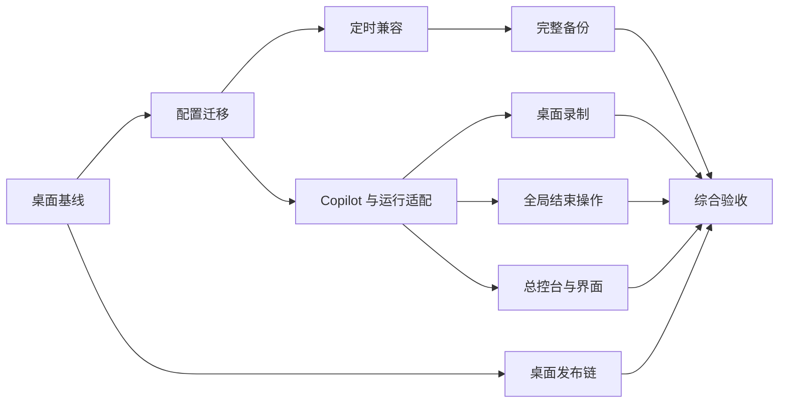

# 桌面端上游同步实施方案

更新日期：2026-09-19。状态：**方案，尚未实施**。本文细化[分支差异与上游同步评估](./分支差异与上游同步评估-2026-09-19.md)，采用其中固定快照：当前 `366205f68e0389288eaafad9807b1d607b46862e`，上游 `a3c24837f4fe2733ad4c7855e29f03b24b86d407`。不因本次范围调整重新选择基线或重算历史差异。

实施路线：**以上游为底座，保留桌面独有功能，转换旧数据，按可独立审查的工作包集成。** 本次只编写文档；下文的改动、构建命令和验收均为未来工作。

本版已纳入用户确认的四项决定，不再作为待选方案：

1. 面向以小白为主的用户，新 GUI 首次启动应自动、无损迁移历史数据；“定时前切换到另一配置”已有用户使用，必须兼容。
2. 今后对外发布仅为 **Windows x64（`win-x64`）和 Apple Silicon macOS（`osx-arm64`）**，两个平台均须完成实际运行验收。
3. 自动全局关机/退出等操作等待所有实例及录制占用释放；手动取消不产生新的自动结束请求。
4. **GUI 构建产物**仍由 `syoius/MFAAvalonia` 发布，保留该层 MirrorChyan `YuanMFA` 身份；供 `syoius/MaaYuan` 的 Action 下载组装。**用户更新的是 MaaYuan 最终包**：`interface.json` 指向 `syoius/MaaYuan`、RID `MaaYuan`，按资源版本检查；不新增独立 GUI 更新入口。

这里的“自动无损”是待实现并以真实样本证明的交付要求，不是已完成或已验证的结论。

更新链路校正：此前版本将保留的独立 GUI 更新方法视作正常用户入口，并据此要求切换 GUI 更新渠道，该判断不成立。本版已按设置页可见性、启动调用链及 MaaYuan 打包源码改正；第 9 节区分构建产物与最终整包，不改变用户已有的资源更新方式。

## 1. 桌面范围与 Android 边界

| 纳入本轮 | 不纳入本轮 |
|---|---|
| Windows x64、Apple Silicon macOS；`win-x64` / `osx-arm64` 两个 RID 的构建与对外发布链 | Android 应用端开发、迁移、定制和改进；Linux、Windows ARM64、Intel macOS 的构建发布承诺 |
| 两个目标平台通过 ADB 控制手机/模拟器；各自适用的 Win32、PlayCover、Gamepad、上游 MacOS 控制器 | Shizuku/root Native Controller、Android 虚拟屏、移动悬浮窗、前台服务、系统定时；Linux WlRoots 控制器专项适配 |
| 桌面 Copilot、录制、实例、定时、总控台、更新、日志与诊断 | MaaYuan 资源 APK、Android Python Agent 打包、APK 更新、Android UI 和设备验收 |
| 桌面用户历史配置、完整实例备份、作业与录制数据兼容 | Android 用户数据迁移、Android CI、Android workload/SDK/NDK 环境建设 |

不安排 Android 后续阶段，不将其失败计为桌面验收阻塞。源码随上游历史自然进入集成分支可以接受：**保留其原样，不主动删目录、不补 fork 功能、不承诺 Android 可运行**。这样可以避免为排除产品范围额外维护大量反向删除补丁。

其他桌面平台的通用源码也可保留；缩减发布矩阵不等于删除平台代码。Apple Silicon 使用原生 `osx-arm64` 包，不以 `osx-x64` + Rosetta 代替验收。不为停止发布的平台移除历史版本，也不向其旧客户端推送不匹配的架构包。

同时不能按名字粗暴排除共享代码：

- 桌面 `Views/Windows/RootView.axaml` 实际嵌入 `Views/Mobile/RootViewContent.axaml`。恢复桌面 Copilot/录制菜单需要修改这一共享视图的桌面分支，这不属于 Android 定制。[U-NAV]
- `AppPaths`、平台工厂、`PlatformTimerScheduler` 等在 Core 中提供通用入口。保留桌面需要的部分及已有空回调逻辑，不移植 Android 实现，不展开平台抽象重构。
- 上游 Release 的 `release.needs` 包含 `build-android-shell`。只跳过 Android 编译而不处理这个依赖，会导致桌面发布被跳过；必须连同依赖和 artifact 收集一起收敛。[U-RELEASE]
- 当前 fork 的 Release 已显式发布 Desktop，但 `Test.yml` 仍有 solution 范围的 `dotnet restore/publish`。两条流水线都应显式定位 Desktop 工程，不能仅凭提交标题“仅 build 桌面端”判断已完成隔离。[F-TEST]

## 2. 集成原则与具体落点

### 2.1 选择与保留清单

| 模块 | 实施决策 | 主要文件/接入点 |
|---|---|---|
| 配置底座 | 使用上游独立实例文件；旧格式仅保留读取与转换，不继续双向维护两套配置存储 | `Configuration/*`、`MaaProcessorManager.LoadInstanceConfig()` |
| 协议、任务与 Agent | 使用上游 MaaInterface、TaskLoader、Processor、AgentHelper；补入 fork 状态隔离及运行上下文 | `Extensions/MaaFW/*`、`TaskQueueViewModel` |
| Copilot | 保留业务及数据；以实际提交的独立任务快照执行；复用上游选项生成 | `CopilotTaskFactory`、`CopilotViewModel`、`CopilotView.axaml(.cs)`、`TaskOptionGenerator` |
| 录制 | 保留游戏动作、回合、SP、桌面悬浮窗和导出；固定录制实例，接入统一的实例占用/取消规则 | `RecordTaskViewModel`、`RecordTaskView.axaml(.cs)`、`RecordingOverlayView` |
| 定时 | 一个全局调度器；保留实例归属、规则级强制启动及同实例跨配置预切换；自动转换旧规则 | `TimerModel`、`GlobalConfiguration`、Timer 设置页、兼容配置快照 |
| 完整备份 | 上游轻量分享继续可用；保留完整实例备份，并读取旧 `.mfa-instance.json` | `InstanceConfigShareService`、实例菜单、未来的备份转换模块 |
| 自动结束操作 | 接在上游结束结果处理之后，保留 fork 的跨实例协调；不复活旧执行引擎 | `MaaProcessor` 结束回调、未来的全局结束操作协调模块 |
| 总控台 | 上游图像来源、排序/缩放/跳转 + fork 内嵌启停、任务名/进度、竖屏布局 | `Monitor*`、任务运行状态汇总 |
| 品牌和更新 | 保留 MaaYuan 主程序名/logo；本仓库提供 GUI 产物，MaaYuan 组装并沿资源通道更新整包；保持独立 GUI 更新隐藏/不自动触发 | `VersionChecker`、Desktop 工程、本仓库 workflow、MaaYuan 的 `install.yml` / `mirrorchyan.yml` |

下文提到的“迁移器、运行上下文、资源写入协调、录制会话、结束操作协调”是**建议的职责划分**，不是宣称仓库已有这些 API。先使用现有服务注册、Processor 命令队列及小型辅助类；不为同步工作引入新插件框架、事件总线或通用调度平台。

### 2.2 分支及提交组织

1. 从固定上游 SHA 创建独立集成分支，保存当前 fork HEAD 为回归对照；旧发布线继续可用。现有历史不 rebase、不强推。
2. 所有开发和运行使用副本数据目录；迁移器通过验收前，不启动新版本读取真实用户目录。
3. 按第 3 节工作包提交；一个 PR 只承担一个明确职责，不混合依赖升级、配置转换和页面重构。
4. `824467c0` 按页面、业务和导航拆分；`733b9303` 按数据、备份和定时拆分；版本号提交不重放。
5. 若最终必须保持当前 fork 为祖先，采用合并提交承接同一最终代码树，并保留合并审查记录。历史组织改变不影响本方案的技术选择。

## 3. 工作包、依赖及完成门槛

所有工作包目前均为“未实施”。PR 编号是建议的交付单元，可按实际文件规模拆成更小提交。

| 工作包 | 内容和边界 | 前置 | 完成门槛 | 估算 |
|---|---|---|---|---:|
| P0 桌面基线 | 固定上游、Desktop 构建入口、隔离数据目录、旧格式样本与功能对照 | 无 | G0：干净桌面基线可编译；不要求 Android 环境；样本来源和预期值可追溯 | 1～2 人日 |
| P1 数据转换 | 字段归属、实例映射、首次启动自动检测/备份/转换/核验、journal 与恢复界面 | P0 | G1：无需手动搬数据；多文件多实例、大小写旧键、失败恢复、重复启动全部通过；原始数据可恢复 | 2～3 人日 |
| P2 定时兼容 | 旧槽位转全局规则、规则级行为、同实例命名快照与前 2 分钟预切换、实例视图及去重 | P1 | G2：跨配置定时自动恢复且可编辑；实例及强制启动策略保留；批量启动不劫持旧规则 | 4～7 人日 |
| P3 完整实例备份 | v1 导入、建议 v2 完整备份、复制/覆盖/新建导入语义及 ID 重映射 | P1、P2 | G3：往返比较任务、Copilot、连接和定时；上游分享格式仍可用 | 1～2 人日 |
| P4 Copilot 与执行适配 | 桌面导航、独立状态、统一选项、校验、实际执行集合、资源互斥、后端调用兼容 | P1；依赖 P0 运行样本 | G4：主页无/未勾选同名任务也能独立运行；页面切换、重载和共享资源不串实例 | 4～6 人日 |
| P5 桌面录制 | 固定目标、占用/取消、动作与 SP 兼容、文件和导出、悬浮窗生命周期 | P4 的实例/资源约束 | G5：切换标签不换目标；退出和停止可收敛；旧录制重载/导出正确 | 2～4 人日 |
| P6 全局结束操作 | 跨实例 pending、一次性关机、取消及幂等执行 | P4 的运行上下文 | G6：A 结束不打断 B；包含录制在内的所有占用释放后执行一次；手动取消不新增请求 | 1.5～3 人日 |
| P7 桌面体验补齐 | 总控台进度/按钮/竖屏、当前实例可编辑性、图片/订阅所有权、布局存储 | P4；集成检查依赖 P5、P6 | G7：多实例及 Copilot 进度正确；关闭和隐藏后资源可回收；上游排序/缩放保留 | 1～2 人日 |
| P8 产品与发布 | MaaYuan 品牌、默认值、两层包名/架构映射、本仓库 GUI 产物与 MaaYuan 组装/上传契约 | P0；最终候选依赖 P1～P7 | G8：两平台最终包可由 MaaYuan 更新入口获取；版本/RID 正确，独立 GUI 更新仍隐藏；桌面发布不等待 APK | 1～2 人日 |
| P9 综合回归 | 真实资源、升级/恢复演练、设备与跨平台、持续运行、候选包 | P1～P8 | G9：第 11 节必测项通过；已知限制不被写成“已支持” | 4～6 人日 |

工作包依赖可表示为：



图示是技术依赖，不是本次安排多代理或并行开发。P4 可以在明确 P1 的数据契约后推进；P8 可以先准备构建和包格式，正式候选必须等待功能完成。

## 4. 配置、定时和完整备份的转换设计

### 4.1 先建立字段归属，不能照抄白名单

迁移输入包括根目录 `appsettings.json`、`config/config.json`、`config/mfa_*.json`、可能已存在的 `config/instances/*.json`、旧完整实例导出，以及录制/缓存/点赞/布局的相关数据。备份清单按真实路径解析，作业数据目录不预设等同于程序目录。

| 输入内容 | 转换/保存规则 |
|---|---|
| `Instances.List/Order/LastActive`、实例名称 | 保留稳定 ID 和顺序；确实有 ID 碰撞时生成新 ID 并持久化映射，修正所有引用 |
| `Instance.{id}.Config` | 先据此找到实例实际使用的配置文件，不能只看当前 `config.json` |
| `Instance.{id}.*`、`instance.{id}.*` 与旧小写字段 | 按旧读取优先级归一化，去实例前缀后写入独立实例文件；冲突有来源记录 |
| 无前缀 fallback | 仅在该实例没有有效 scoped 值时补齐；禁止拿另一个实例的同名键兜底 |
| `TaskItems/CurrentTasks/ResourceOptionItems` | 保留顺序、重复任务、勾选、参数和自定义 converter 语义；不通过重新生成默认列表替代旧状态 |
| `CopilotTask` | 作为实例字段迁移，保留所有可序列化选项；运行时再按最新资源定义恢复和校验 |
| `Timer.TimerN*`、`CustomConfig`、`ForceScheduledStart` | 专门读取；转换成带来源和所属实例的全局规则，不能依赖上游实例字段白名单 |
| GUI/更新/通知等配置级设置 | 按实际 getter/setter 建立归属表；明确属于全局的只写全局，确有按实例差异的保留实例覆盖；不得无报告取“第一个配置” |
| 作业缓存、活动作业、录制、点赞与布局 | 保留文件/键和值；路径迁移只在上游 AppPaths 实际改变其桌面位置时执行 |
| 未识别字段或无法归属的旧数据 | 原样进入可恢复的兼容数据区并记录；**仅存档不代表功能已兼容**，影响已承诺行为的字段仍阻塞验收 |

一个 `mfa_*.json` 含多个实例时按实例拆分，不能沿用上游“一个旧文件转一个新实例”的全部处理。多个旧配置对同一实例提供不同快照时，实际绑定的配置作为当前态，其他快照保留为可命名配置快照，供历史定时/恢复使用，不擅自合成一个值。

### 4.2 迁移执行顺序与恢复

上游 `ConfigurationManager.Configs` 有静态初始化，`LoadInstanceConfig()` 会继续触发旧配置迁移。只在窗口打开后追加转换逻辑太晚。应在路径和最小日志可用后，**第一次会写配置的类型初始化、首启模板提升、上游旧配置迁移、实例/定时/自动启动之前**执行 fork 转换；通过调用链核验落点，不预设插入某一行就充分。[U-BOOT] [U-CONFIG]

建议的阶段为：

1. **读取与计划**：只读扫描旧文件，生成实例/规则映射、来源 hash 和差异报告；没有修改文件。
2. **备份**：完整保存受影响原文件及清单，确认备份可读取。目标是恢复该次升级之前的组合状态。
3. **暂存**：生成新实例文件、全局规则和兼容数据，重新反序列化核对任务、选项、ID 引用及数量。
4. **提交**：通过 journal 记录已完成的文件替换，最后写迁移完成标记。多文件不能假定一个 rename 就全部原子完成。
5. **恢复**：若上次 journal 未完成，先恢复一致状态或继续已验证步骤，阻止正常实例/定时/自动启动；不把半套新文件当成功迁移。
6. **正常加载**：完成后交给上游实例管理。对已转换的 fork 输入跳过上游的重复/破坏性旧迁移路径；仍允许处理真正的通用上游旧格式。

已存在新版文件时默认不覆盖其中的新修改。只有迁移清单能证明是本次未完成写入，才可继续；否则产生差异报告。迁移幂等基于版本、稳定映射与完成状态，不能因旧文件 hash 改变就自动重跑并覆盖新数据。

**面向普通用户的首次启动流程也是 P1 必交付内容：**

- 用户启动新 GUI 后自动定位既有数据目录并完成上述阶段，正常路径不要求导出/导入、编辑 JSON、选择 schema 或重建定时。沿用原数据位置及可信的安装/更新记录；路径不确定时不能扫描后随意挑一份覆盖。
- 仅显示“正在升级配置，请稍候”等简明进度；成功后显示迁移完成摘要并直接进入保留原实例、配置和定时的界面。来源映射、hash 和 journal 放在诊断记录中。
- 完成校验前暂停实例加载、定时、CLI 自动启动和首启模板写入；单实例启动/迁移锁阻止两个进程同时转换，旧 GUI 未退出时给出明确提示，不能边运行边迁移。
- 失败时保留原件与备份，自动回到一致状态；界面提供“重试”“恢复升级前数据”和打开诊断位置等入口，不进入半迁移的正常任务界面。恢复失败也不能继续覆盖原件；异常数据可停在恢复界面，不能为实现“自动”而丢弃字段。
- 正常成功后按保留的设置恢复自动启动/定时，不额外补执行迁移期间错过的发生时间。自动识别不可用目录、空间/权限不足、文件锁、重复启动及中断恢复均纳入验收。

无损核验按实例、配置快照和规则比较有效值及引用，同时核对作业/录制等文件的内容或 hash；仅比较实例数量、保留一份备份或成功反序列化都不够。损坏的历史输入需保留并给出可恢复报告，不承诺自动修复原本缺失的数据。

### 4.3 定时规则的语义转换

当前 `TryPreSwitch()` 使用配置名，并在计划时间前 2 分钟尝试切换**同一实例**的配置；上游 `TimerConfig` 则存实例 ID。上游 `CustomConfig`、`ForceScheduledStart` 是全局值，开启 `GlobalStartEnabled` 还会让开始型定时走全局启动路径。[F-TIMER] [U-TIMER]

因此，直接逐键复制存在三类确定风险：配置名被当实例 ID；不同实例的强制启动差异消失；原本只启动 A 的规则变成批量启动。采用以下转换规则：

| 旧语义 | 新规则设计 |
|---|---|
| 每实例固定 8 槽 | 只要是用户保存过的规则就迁移，包含已禁用规则；未保存的默认空槽可省略；UI 按所属实例筛选同一全局集合 |
| `CustomConfig=false` | 固定目标为规则所属实例，不能退化成“触发时当前激活实例” |
| `CustomConfig=true` 且目标为该实例当前配置 | 仍绑定所属实例与命名快照 ID；执行时确实已激活该快照才省略切换，防止其他规则切走后失去原目标 |
| `CustomConfig=true` 且目标为另一个配置 | 使用下文“同实例配置快照兼容”，禁止简单按名字转到另一个正在运行的实例 |
| 各实例不同 `ForceScheduledStart` | 存为规则级可选覆盖；迁移规则写入明确值；新建通用规则可继续继承上游全局默认 |
| 开启全局批量启动 | 为迁移规则标明“单实例”范围，执行优先读明确范围；用户新建/调整为“全局批量”的规则才走全局启动 |
| 旧周期/时间/启用状态 | 保留序列化语义，包括月末无对应日期的行为；按旧来源记录映射，不用当前语言文本识别周期 |

**同实例配置快照兼容：** 将旧配置的实例有效数据转成命名快照；规则持有快照 ID，在实例空闲且相关资源可修改时应用到同一个新版实例，再按原有预切换时点/强制停止策略调度。它是一个读取新版实例数据的兼容层，不恢复旧 `_instanceConfigMap` 全局切换架构，也不为每份配置创建一个可能争用同一模拟器的新运行实例。

需要保留快照的任务/连接/运行设置归属，避免应用快照覆盖新全局定时集合。目标配置缺失、名称歧义或资源失效时，保留原规则和原因，停止该次执行；不能静默改成运行当前任务。**用户已确认使用跨配置定时，兼容层、界面和验证属于 P2 必做范围，成本已计入第 10 节总量**，不能留作升级后的手工修复。

兼容层按以下步骤落地：

1. 从原始文件直接解析每条规则的配置名，在旧 getter 自动回退前保存其真实值；按来源文件和所属实例建立快照映射，不能只按显示名去重。为规则保存实例 ID、快照 ID、来源槽位与显式强制启动策略。
2. 保存当前激活快照身份。离开前可靠保存该配置的实例级编辑，切回时恢复其最新有效值；不把快照做成每次切换都会覆盖用户新修改的只读历史副本。配置级共享值按第 4.1 节的归属转换，不随快照覆盖全局状态。
3. 在发生时间前 2 分钟预约目标实例和所需资源；空闲时切换，忙碌且允许强制启动时请求停止并等待真实释放，再应用快照。录制占用沿用第 6 节安全停止/保存约束，未释放前不强行覆盖。
4. 到触发时刻重新核对目标身份、资源与占用。若错过预切换但已空闲，可在本次触发内先切换再启动；未能安全切换则跳过本次并提示，不运行错误配置。启动返回拒绝时不能记作成功。同实例同一时刻的冲突规则按稳定顺序处理并报告，不能同时覆写实例；不同实例独立触发。
5. 定时页继续以用户熟悉的配置名称显示和编辑目标；内部使用稳定 ID。重命名同步显示，删除被引用快照前提示影响；迁移后无需逐条重建或重新启用规则。复制/完整备份带上引用快照并重映射 ID。

第 3～4 步保留原本前 2 分钟预切换的正常路径；错过窗口、目标失效和并发冲突时的处理是本方案提出的防误跑规则，需在 P2 行为样本中单独列明，不能宣称旧实现已经具备。至少覆盖 A→B→A、切换后修改再切回、跨午夜、临近触发才启动 GUI、共享资源忙碌、停止延迟，以及重复回调不重复执行。

全局执行器只保留一份定时循环；新增规则覆盖字段需要贯穿加载、保存、删除重编号、复制、导入和 `SaveAll()`。建议增加稳定 `RuleId`，保留上游槽位编号作为存储索引；不要把 `TimerId` 重编号视为规则身份变化。去重使用规则身份和发生时间，多个实例规则恰好同一时刻不能被合并掉。

### 4.4 完整备份与上游分享并存

| 操作 | 必须包含/保持 |
|---|---|
| 上游分享文本 | 继续采用原 `mfa-instance-sharing/v1` 契约；不擅自改变其 payload 含义 |
| 旧 `.mfa-instance.json` 导入 | 读取 `version/sourceInstanceId/sourceConfig/data` 及兼容的历史形式；任务、Copilot、定时按旧格式转换 |
| 新完整备份（建议 v2） | 版本、源实例身份、项目/资源身份、实例数据、属于该实例的规则及兼容快照；任务使用项目现有序列化 converter |
| 实例复制/新建导入 | 新实例 ID，规则引用重映射，深拷贝；保留定时启用状态，不在导入完成这一刻额外补执行 |
| 覆盖现有实例 | 先按完整占用状态停止并等待释放，再做目标实例备份；替换其数据及所属规则，不清除其他实例规则 |

当前所谓“完整实例导出”是配置层备份，并不包含所有二进制资源、共享作业缓存和录制文件。v2 应明确同样边界；资源文件仍独立备份/交付，不能在导入报告中声称已恢复并未打包的活动作业文件。

导入结束后输出成功转换数、未解析引用和保留但未应用的字段。未知未来版本显式拒绝或只读预览，避免把未知字段解析为空后覆盖已有配置。

## 5. Copilot 与任务执行的接入

### 5.1 独立任务状态的完整链路

按“资源定义 → 实例 Copilot 状态 → 本次执行快照”建立单向数据流：

1. 从当前 interface 找到默认 Copilot 任务定义，保留旧名称匹配兼容；克隆定义后再恢复保存值。
2. 选项按名字匹配最新定义，恢复重复次数、input 数据、select/switch、checkbox 的选择及嵌套状态；失效值有明确回退/校验结果。
3. 保存对象与执行对象都独立克隆，不能借 `DragItemViewModel.Clone()` 的副作用改变主页勾选；嵌套字典/列表也不能共享可变引用。
4. 复用上游 `TaskOptionGenerator` 的保存回调，为 Copilot 保存其独立对象；去掉旧 code-behind 中重复的选项控件生成逻辑。
5. 缓存和异步回调携带实例 ID、资源/配置代际；标签切换、导入、资源重载后，旧控件事件不能写入新对象。

默认入口缺失时清楚提示，保留用户保存的 Copilot 状态，不自动创建同名主页任务。主页不存在该任务、任务未勾选或选项不同都不影响 Copilot 的数据来源。

### 5.2 不只适配 `Start()` 签名

进一步源码核验发现三个具体问题：[U-RUN] [U-PROCESSOR]

- 上游 `TaskQueueViewModel.StartTask()` 的资源/设备和 input 校验围绕主页列表。Copilot 直接调用 `Processor.Start(list)` 会绕过该入口。
- `BeginTaskRun(tasks)` 可接受传入集合，但 `FinalizeTaskRun()`、耗时更新等后续逻辑仍遍历 `TaskItemViewModels`。独立快照可能启动成功，却得不到正确的耗时、取消收尾或汇总。
- `Processor.Start(...)` 返回 `void`，且忙碌时可直接拒绝。调用方不能把“调用返回”视为“启动已被接受”。`StopTask()` 会先把 UI `IsRunning` 置为 false，后台清理未必已经结束。

最小适配方案：

| 接入点 | 要完成的改动 | 保持的约束 |
|---|---|---|
| 启动校验 | 提取/复用能接受“实际任务集合 + 目标实例”的校验逻辑，合并该实例有效的 global/controller/resource options | 不为启动 Copilot 临时改主页勾选，错误标到 Copilot 页面 |
| 实际运行集合 | 保留本次 `runId` 对应的任务集合；状态、耗时、失败、取消和完成统计均对该集合操作 | 主页持久化仍只保存主页任务；相同 Name 不能作为运行对象身份 |
| 启动接受 | 在现有 Processor 排队/占用逻辑处提供明确的接受、拒绝或完成通知 | 继续使用上游执行引擎；不能在外层检查 Idle 后假设不会竞争 |
| 停止完成 | UI 可以即时反馈，但资源和实例占用直到后台运行链及清理真正完成才释放 | Copilot、录制、定时和更新共用同一事实来源 |
| 运行上下文 | 使用实例 ID + runId + 来源（主页/Copilot/定时等）跟踪通知与结束结果 | 防止旧回调结束新运行，防止同名任务误更新主页 |

这部分是 P4 的重点：新增小范围的执行集合与状态接入，不重写上游命令队列、连接逻辑或 Tasker 状态机。

### 5.3 资源写入与重载

Copilot 加载/卸载修改的是共享 `pipeline/copilot` 文件。首轮保留“共享活动作业”语义，不开发每实例独立作业覆盖层。

按以下顺序实现：

1. 解析目标资源实际路径集合。名称不作为唯一锁键；处理重叠目录、相对路径、平台大小写规则，必要时解析链接别名。
2. 普通任务、Copilot 和录制在进入真实占用状态前登记资源使用；加载/卸载取得排他写入资格，重新检查占用。入口放到统一运行接入处，覆盖定时、CLI、总控台等启动来源。
3. 先在暂存目录读入并验证新作业；只管理 Copilot 活动文件，保留 `copilot_config.json`，不得清理整个资源树。
4. 停止/释放需要重建的旧资源对象后完成替换；替换或重载失败则恢复上一活动文件集，保持页面状态与磁盘一致。
5. 发布资源代际失效通知。使用同一路径的其他空闲实例也必须在下次运行前重载，不能只重置当前 ActiveTab 的 Processor。
6. 等待、释放和 UI 通知都避免持有同步锁跨越长时间网络/控制器操作；取消后能释放写入资格。

网络下载可以先完成，但真正激活前必须重新核验占用。作业切换不能与“正在启动”“正在停止”“录制动作未结束”并行，仅锁住页面按钮不满足要求。

### 5.4 后端与文件兼容

保持现有主/备域、神秘代码及作业集协议、文件命名兼容和点赞历史。网络调用层可做小规模集中，保留原错误处理和取消语义；录制导出目前是单一主站接口，不在本轮擅自承诺备用导出接口。

验收样本包含：本地 JSON/JSONC、单作业代码、作业集、嵌套缓存目录、已点赞历史、非法文件、主站失败回退、导出失败。离线解析与模拟响应可先验证；真实后端只在后续集成验证阶段使用。

## 6. 桌面录制实施细则

P5 保留现有动作模板、坐标、回合、旧 token/通用 SP 解析及导出结构，不增加通用键鼠捕获或移动端录制。

| 生命周期 | 预期行为 |
|---|---|
| 开始录制 | 固定实例 ID/资源代际/控制器目标，取得该实例操作资格；同实例正在启动/执行/停止时明确拒绝或等待停止完成，不与任务并发输入 |
| 操作执行 | 继续复用 Click/Swipe/AppendTask，串行处理动作；动作结果和记录状态一致，失败不能无提示写成成功动作 |
| 切换标签 | 悬浮窗仍绑定原实例；日志可以跟随录制目标，不根据 ActiveTab 重新选择控制器 |
| 关闭目标/重连/资源切换 | 先结束未完成操作再解除会话；目标消失后提示，不回落到任意其他实例 |
| 停止/关窗 | 取消等待、停止未完成的 pipeline job，等待真实结束后释放实例；不能只关闭悬浮窗后留下后台动作 |
| 保存/导出 | 本地录制先可靠落盘，失败可重试；导出服务失败时本地数据仍完整；历史文件可重载继续编辑 |

`AppendTask(...).WaitFor(...)` 等阻塞调用需要对应的取消/停止路径，具体使用新版 binding 的已核验 API；不能靠直接 Dispose 仍在使用的 Tasker 实现停止。录制输入期间实时画面沿用上游截图机制，避免录制页额外启动另一套截图循环。

实例复制或普通配置导入不迁移“正在录制”的运行状态；未保存录制退出仍保留现有保存/放弃交互。不同桌面平台下的窗口置顶、缩放和动作坐标分别验证。

## 7. 自动结束操作的明确规则

用户已确认两项原则：全局自动结束操作等待所有实例及录制占用释放；手动取消不产生新的自动结束请求。以下是落实原则的实施规则，其中一次性标记、优先级和幂等细节仍需通过行为验收。

P6 针对自动 `AfterTask` 及其由任务完成产生的请求，不拦截用户手动退出，不擅自改写特殊任务中明确要求立即执行的计算机操作。CLI `--quit-after-run` 继续遵循其目标运行的契约，需单独回归，不能因共用最终退出方法而被无意改变。

| 情况 | 实施规则 |
|---|---|
| 一个实例成功/失败完成 | 在上游判定应执行 AfterTask 的结果路径产生一次请求；保留上游成功/失败处理，不在按钮层提前触发 |
| 还有其他启动/执行/停止或录制会话 | 全局关闭、重启、关机等待所有占用释放；关闭当前目标软件等实例局部动作按原语义处理 |
| 多个全局请求 | 采用原 fork 优先级；同优先级使用稳定顺序；合并后只执行一次，保留参与请求和目标身份用于正确收尾 |
| 手动取消当前运行 | 不新增自动结束请求；已由其他完成运行产生的有效请求继续保留；不把“取消 B”解释为取消 A 的已完成请求 |
| 强制停止后重启 | 旧运行的取消不触发旧 AfterTask；新 runId 独立追踪，pending 判断覆盖重启预约窗口 |
| `ShutDownOnce` | 按关机优先级参与协调；真正提交关机执行时再清除参与并被满足的一次性标记，不在入队时清除 |
| 实例/窗口关闭 | pending 保存必要身份与动作数据，避免依赖已释放 ViewModel；目标已不存在时局部动作跳过并记录，全局请求按其有效性处理 |
| 重复回调或同一时刻多个完成 | 按来源实例/runId 幂等，最终检查“仍无占用”与执行预约在同一协调边界内完成 |

pending 只存在于本进程，不在下次启动时恢复并执行上次未完成的关机请求。自动结束操作的测试使用可观察的替代执行器验证决策；必要的真实系统动作验证放在隔离环境。

## 8. 总控台、选项与桌面界面

### 8.1 总控台的组合方式

- 上游保留：共享 LiveView 图像来源、卡片排序/缩放、右键菜单、单击跳转、全屏等已有能力。
- fork 补回：内嵌启停、当前任务名、主任务进度、竖屏默认布局及圆角。
- 按钮事件应阻止冒泡误触卡片跳转；开始/停止依然指向卡片所属实例。
- 上游 `MonitorItemViewModel.Image` 引用任务页面的 `LiveViewImage`；它不是 fork 旧实现中每次新建的独占 Bitmap。**不能把旧 `Image.Dispose()` 原样复制过来**，应保持图像所有者负责释放，监控页只解绑引用/订阅。[U-MONITOR]

进度从第 5 节实际运行集合聚合，主任务总数不含连接、预处理等辅助步骤；失败/跳过与成功有区分，不能把“处理完”显示成“全部成功”。重复次数在任务状态中保留，统计口径与主页一致；Copilot 没有主页行也应有有效进度。

### 8.2 实例可编辑性与布局

空闲 B 的实例任务/控制器配置可编辑，不因 A 运行而整页锁死；修改共享资源和全局设置则遵循对应作用域的约束。旧 `TrySetActiveConfigValue` 及配置对象锁不整体移回，上游独立文件模型中按实际作用域接入保存。

`GridLengthStorage` 的读写显式绑定目标实例；异步切换后不能把列宽写给新 ActiveTab。新版 Dashboard layout 的 hash/后缀字段保留原值或使用明确转换；不识别的布局仅布局回退，不重置任务和选项。

桌面导航、服务注册、语言键与资源字典一起检查。复用 `RootViewContent` 中已有桌面布局，不重做整套导航。保留现有中文文案并补齐所需语言键，缺翻译使用项目既有回退；不把新日语等上游本地化能力覆盖掉。

## 9. 桌面构建、产品身份与交付

### 9.1 构建边界

未来验证与 CI 应显式指定 Desktop 工程，例如 Windows x64：

```text
dotnet restore MFAAvalonia.Desktop/MFAAvalonia.Desktop.csproj -r win-x64
dotnet build MFAAvalonia.Desktop/MFAAvalonia.Desktop.csproj -c Release -r win-x64 --no-restore
dotnet publish MFAAvalonia.Desktop/MFAAvalonia.Desktop.csproj -c Release -r win-x64 --no-restore
```

Apple Silicon macOS 在原生 ARM64 macOS runner 上执行：

```text
dotnet restore MFAAvalonia.Desktop/MFAAvalonia.Desktop.csproj -r osx-arm64
dotnet build MFAAvalonia.Desktop/MFAAvalonia.Desktop.csproj -c Release -r osx-arm64 --no-restore
dotnet publish MFAAvalonia.Desktop/MFAAvalonia.Desktop.csproj -c Release -r osx-arm64 --no-restore
```

本仓库 Release/Test 的桌面 RID 矩阵、artifact 收集、GitHub 附件与 `YuanMFA` 上传均收敛为 `win-x64` / `osx-arm64`；ARM64 runner 的可用标签以 fork 实际环境核实。MaaYuan 下游的下载/组装/最终附件与 `MaaYuan` 上传需同步收敛，名称映射见第 9.3 节，不能只改本仓库就认为整包发布矩阵已完成。只使用实际依赖项目；已有 Markdown 测试需单独指定测试工程。以上为未来检查建议，本次未执行，也不代表目标环境已经安装 SDK/native 依赖。

Release/Test 的 PR 触发分支应匹配 fork 实际目标，不能把不存在的 `main` 或仅上游的分支名照搬。去除桌面发布对 `build-android-shell` 的依赖及 APK 收集/上传；Desktop 必要的共享 Core 项目引用继续保留。没有 Android workload 的干净环境必须能完成桌面构建。

### 9.2 已核验的实际更新链路

**用户的记忆与源码一致：当前分支和固定上游都没有向普通用户展示独立 GUI 更新入口。** `UIUpdateChannelList`、`EnableAutoUpdateMFA`、`CheckMFAUpdateCommand`、`UpdateMFACommand` 对应容器均为 `IsVisible="False"`；启动检查中 `AddMFAUpdateTask()` / `AddMFACheckTask()` 分支均被注释。正常入口为资源检查/更新。[F-UPDATE-UI] [U-UPDATE-UI] [F-UPDATE] [U-UPDATE]

两端的资源检查均从 `MaaProcessor.Interface.Github/Url` 取仓库、从资源版本取比较值、从 `Interface.RID` 取 MirrorChyan 身份。本机 `C:\MaaY` 的 MaaYuan 快照 `5684509e5cfdc0de90d42d29c36373a453848357` 进一步确认了以下契约；引用文件与该提交一致，本次未修改 MaaYuan 仓库，也未把本地快照宣称为远端最新版本：[Y-PACK] [Y-INTERFACE] [Y-INSTALL] [Y-MIRROR]

| 层次 | 实际契约与处置 |
|---|---|
| GUI 构建产物 | `syoius/MFAAvalonia` 提供 `MFAAvalonia-*` 附件；本仓库 `YuanMFA` 是该层发布身份，不是普通用户的资源更新 RID |
| MaaYuan 组装 | 下游 `install.yml` 用 `release-downloader` 下载 `syoius/MFAAvalonia` 的 latest 对应平台附件，解压后复制到已准备资源/Agent/Python 的 `install`；是消费发布产物，不是调用本仓库 reusable workflow |
| 最终包版本 | `install4release.py` 将 MaaYuan 的构建 tag 写入 `interface.json.version`；GUI 自身版本可显示，但不替代资源版本作为正常更新比较值 |
| 用户 GitHub 更新 | `interface.json.github = https://github.com/syoius/MaaYuan`；下载该仓库最终包，不改为 `syoius/MFAAvalonia` |
| 用户 MirrorChyan 更新 | `mirrorchyan_rid = MaaYuan`、`mirrorchyan_multiplatform = true`；下游上传工作流也使用 `MaaYuan`，按系统/架构选择整包 |
| 旧通用资源通道 | 下游另上传只含 `resource/interface.json/config/agent` 的通用包，未包含 GUI；应与多平台整包区别验收，不能声称每种资源更新包都一定升级程序 |
| 框架与辅助入口 | 保留框架更新、CDK 查询和帮助链接各自用途；不能全局替换字面量 `MFAAvalonia`，也不因仍有隐藏命令便新增 GUI/框架更新界面 |

独立 GUI 检查/下载方法中确实还存在 `MFAAvalonia`、`SweetSmellFox`（上游为 `MaaXYZ`）默认值，但**这不能证明正常 MaaYuan 更新会切到通用 GUI 包**。CDK 查询也使用 `MFAAvalonia`，应单独判断其查询用途，不能与资源包下载混为一谈。本轮保持已有入口策略，不为这些残留方法专门建设 GUI 更新渠道。

**上游延续了“资源版本驱动、包可包含 GUI”的模式，但更新器内部已变化。** 当前 `UpdateResource()` 已会复制整包并重启；新版通过 `ContainsCoreApplicationFiles()` 识别包含程序的包，分发到 `AppPaths.DataRoot/InstallRoot`，在写入前停止 Tasker/Agent，以 `UpdateFileTransaction` 处理文件替换并在成功后提交版本元数据，再重启。包校验、增量处理、入口改名、目录映射和本地资源包入口仍需回归，不能以更新选项没变推断底层完全没变。[U-UPDATE-PAYLOAD]

P8/P9 的验证顺序改为：

1. 用候选 GUI 产物让 MaaYuan 在测试工作流中组装最终包，显式指定待验 tag/附件，记录资源版本及 GUI SHA；现有 `latest: true` 不足以保证候选可复现。不要先改正常 latest 指向，再把普通用户当验证样本。
2. 核验最终 `interface.json`、包内容和请求：查询 `syoius/MaaYuan` / `MaaYuan`，比较 MaaYuan 资源版本；GUI 独立入口保持隐藏，自动检查不产生独立 GUI 安装请求。
3. 从真实旧 MaaYuan 整包沿既有资源更新入口升级，覆盖 GitHub 全量、MirrorChyan 多平台全量/增量及旧通用资源响应。需要升级 GUI 的这次发布，所用整包/差分必须实际携带新 GUI 和必要运行依赖；通用资源包不能被误当作完成 GUI 迁移的证据。
4. 对比升级前、旧更新器写入后、新 GUI 首启迁移后三个时点的数据。**首次升级的文件替换由旧更新器执行，新版事务保护不能倒过来保护这一段。** 检查最终包与差分清单不会覆盖/删除旧实例配置、作业和录制等用户数据；只放首启模板、不携带用户配置快照。若样本暴露旧更新器限制，再按具体问题评估过渡包，不预设必须更换渠道。
5. 验证重启进入新 GUI 后自动完成第 4 节迁移，跨配置定时继续可用。更新失败和迁移失败均可恢复，不能以手工搬配置作为正常路径。

仅发布 GUI 产物不会改变用户的资源版本；需要 MaaYuan 组装并发布具有新资源版本的最终包，用户才会沿原通道发现本次升级。这是正常发布依赖，不是旧客户端“无法到达新 GUI 渠道”。停止支持平台的包选择也在 MaaYuan 最终包/服务层核验，保留历史版本，不向其回退发送不匹配架构包。

### 9.3 包格式与默认值

包格式需要区分两层，不能把本仓库的 ZIP 当成 MaaYuan 最终包格式。MaaYuan 现有 `install.yml` 已对 Windows 输出 ZIP、对 macOS 输出保留权限的 tar.gz，上传规则与之相符；**本轮无需因上游同步再“迁移 macOS 最终包到 tar.gz”**。[Y-PACK] [Y-MIRROR]

| 目标平台 | 本仓库 GUI 产物 | MaaYuan 最终产物 |
|---|---|---|
| Windows x64 | `MFAAvalonia-<GUI版本>-win-x64.zip` | `MaaYuan-win-x86_64-<资源版本>.zip` |
| Apple Silicon macOS | `MFAAvalonia-<GUI版本>-osx-arm64.zip` | `MaaYuan-macos-aarch64-<资源版本>.tar.gz` |

首轮保留 GUI 产物契约；若采用上游对 GUI Unix 包的 tar.gz 后处理，需同时验证下游下载/解压/清理，不让压缩包残留进最终产物。`arm64` / `aarch64`、`osx` / `macos` 是不同层的命名，按下载器和服务契约映射，不能全局替换；MirrorChyan 上传 Action 和客户端参数的归一化需用实际请求/响应验证。

两层工作流的矩阵、release 依赖及收集范围需一致。所核验的 MaaYuan 快照仍含其他桌面架构和 `build-android` 发布依赖，不能在本仓库停止提供包后仍让下游等候不存在的产物。本轮只要求桌面组装/发布不受这些作业阻塞，不迁移或定制下游独立 Android 实现；具体工作流拆分属于未来 P8 跨仓库配套事项，本次不改代码。

在 Apple Silicon 真机检查最终包解压后的可执行权限/签名、native 库及内嵌 Python/Agent 架构，不依赖 Rosetta 掩盖混入的 x64 依赖。MaaYuan 的 macOS 组装还会复制自己的 `MFAUpdater`，应纳入最终包与重启验证，不仅验证本仓库的单独产物。

保持 `MaaYuan(.exe)`、logo、CLI 启动/重启和实际入口一致；无需为主程序改名一并改写所有程序集名称。GUI 版本与 MaaYuan 资源版本分别按各自 tag 管理，本次面向用户的升级必须提升资源版本并明确发布通道；不能只提升 GUI 版本便期望资源检查发现升级。

保留当前 `SaveOnError=false` 默认值和用户已设置值；说明其对失败截图证据的影响。继承上游遥测开关、资源侧配置和日志机制，不另建一套遥测流程；不使用通用上游资源的诊断配置替代 fork 自己的资源配置。

## 10. 里程碑、工期及风险收敛

第 3 节工作包合计约 **21.5～37 人日，建议按 22～38 人日规划**，假设一名熟悉项目的开发者及可用的 Windows x64 / Apple Silicon macOS 设备。P2 已包含原先条件估算的跨配置兼容增量 2～4 人日；首次启动自动迁移/恢复体验在 P1 内，两平台完整回归在 P9 内，不重复加价。发布矩阵缩减可减少打包和平台分支工作，但不按平台数量比例削减配置、Copilot 和生命周期适配；macOS ARM64 的完整链路验收也不能降为可选冒烟。

| 里程碑 | 完成内容 | 可验证结果 |
|---|---|---|
| M0 基线就绪 | P0 | 桌面能构建，有旧数据样本和保留行为基准 |
| M1 数据兼容 | P1～P3 | 首次启动自动完成旧实例/跨配置定时/备份兼容，失败可恢复，新版基础任务可加载 |
| M2 功能闭环 | P4～P7 | 抄作业、录制、跨实例结束操作和总控台组合可运行 |
| M3 发布候选 | P8、P9 | 两个指定平台候选包、升级/恢复、更新身份及完整运行矩阵通过，具备发布条件 |

上述工期已包含确认的跨配置定时、P8 两层发布契约及 P9 整包更新回归。撤回此前以“独立 GUI 渠道对旧客户端不可达”为由预列的 1～3 人日增量；实际链路使用已有 MaaYuan 资源渠道。以下未验证条件需在样本评审后重估，不能通过减少验收隐去：

- 若实际旧包仅获取不含 GUI 的通用资源，或旧更新器无法安全替换候选整包，应针对该旧版本设计兼容包/过渡措施；以实测问题估算，不预设新渠道或固定增量。
- 历史数据损坏、多代未记录格式、资源 Agent 与新版 MaaFW 不兼容：先定位具体样本后重估，不预先给固定天数。
- Windows x64 或 Apple Silicon macOS 设备缺失是验收证据缺口，不能把“交叉编译成功”折算成“该平台已测”；Linux、Windows ARM64、Intel macOS 不再计入本轮发布回归。

首轮排期不包含每实例独立作业覆盖层、通用录制器、后端协议升级、全新 UI、平台抽象重构和 Android 工作。把这些内容加入会扩大范围，应独立列项。

## 11. 验收清单与发布条件

### 11.1 必测的桌面行为

| ID | 验证输入/操作 | 通过条件 | 所属门槛 |
|---|---|---|---|
| D01 | 一文件多实例、多文件同名配置、旧大小写键、无前缀 fallback | 实例不合并、不串值；顺序和配置来源可追溯 | G1 |
| D02 | 迁移中断后重启、重复迁移、新旧文件并存 | 恢复一致状态、不覆盖新修改、不重复创建；原目录可恢复 | G1 |
| D03 | A/B 强制启动设置不同；切换 ActiveTab；开启全局批量启动 | 迁移规则仍按所属实例和规则级策略运行 | G2 |
| D04 | 跨配置定时、目标缺失、前 2 分钟预切换、忙碌/停止延迟、A→B→A、临近触发启动 | 自动迁移后同实例按目标快照运行，切回保留编辑；无效目标/冲突有报告、不误跑、不重复 | G2，必测 |
| D05 | v1 导入、v2 往返、复制、新建/覆盖导入、上游分享文本 | Copilot/定时/连接完整；ID 重映射正确；其他实例不受损 | G3 |
| D06 | 两平台旧安装升级后直接启动新 GUI；权限/空间不足、文件锁、中断和重启 | 自动检测/备份/转换/校验；无需手动搬数据或重建定时；故障有恢复入口，半迁移不启动任务 | G1、G9 |
| C01 | 主页无抄作业任务、取消勾选、设置不同值 | Copilot 独立执行及保存；主页顺序/选项不变 | G4 |
| C02 | checkbox/hotkey/input/嵌套选项、无效输入、资源更新 | 默认值/恢复/校验及 pipeline 参数一致；错误出现在正确页面 | G4 |
| C03 | Copilot 成功、失败、取消、快速停止再启动 | 状态/耗时/收尾基于实际集合，旧 runId 不污染新运行 | G4 |
| C04 | 同路径不同资源名、共享资源实例、写入时启动、重载失败 | 写入与运行互斥；旧作业可恢复；其他实例不使用失效资源缓存 | G4 |
| R01 | 录制中切标签、关闭目标、取消动作、关闭悬浮窗 | 不改目标、不遗留动作/占用、可保存未导出数据 | G5 |
| R02 | 老 SP/通用 SP、回合编辑、保存重载、导出失败 | 数据不丢失；动作结果与录制记录一致 | G5 |
| A01 | A 完成、B 启动/运行/停止/录制；多个 AfterTask 并发 | 释放前不执行全局动作，释放后只执行一次正确优先级 | G6 |
| A02 | 一次性关机、手动取消、强制重启、CLI -q | 一次性标记和 runId 正确；自动策略不误改变显式退出语义 | G6 |
| U01 | 总控台内嵌按钮/进度、排序/缩放/跳转、页面多次开关 | 两套所需功能同时存在；不双重 Dispose 共享图片 | G7 |
| U02 | A 运行编辑 B、布局切换、资源/配置延迟回调 | 实例设置可正确编辑，旧回调不写新实例 | G7 |
| P01 | 两个指定 RID 的干净桌面 runner，无 Android workload；MaaYuan 组装候选产物 | Desktop 构建通过；下游下载/解压和命名映射正确；两个目标整包形成，桌面发布不等待 APK | G0、G8 |
| P02 | 两平台旧 MaaYuan 整包经资源入口更新；全量/增量/通用包、失败恢复及非目标架构请求 | 查询 `syoius/MaaYuan` / RID `MaaYuan`、比较资源版本；所需 GUI 随整包更新，独立 GUI 入口不恢复；数据在旧更新器写入和新 GUI 迁移两阶段均保留 | G8、G9 |
| N01 | 多 ADB、Win32 失效窗口、Agent 多连接/退出、特殊任务及 CLI | 继承的上游能力没有被 fork 接入破坏 | G9 |
| N02 | 首启模板/已有配置、Markdown/日志导出、诊断开关 | 新能力有代表性验证，模板不覆盖旧数据，默认值符合 fork 策略 | G9 |

配置/规则转换、状态隔离、生命周期和结束操作适合必要的自动化测试；网络协议先用固定响应。设备控制、桌面窗口、持续图像和真实升级需要集成或人工验证。避免为纯 XAML 布局调整或实现细节编写没有行为价值的测试。

### 11.2 桌面平台矩阵

| 平台 | 构建/打包 | 运行证据 |
|---|---|---|
| Windows x64（`win-x64`） | 必须 | 完整链路：直接启动自动迁移、跨配置定时、多 ADB/Win32、Copilot、录制、结束操作、总控台、真实更新/恢复及 CLI |
| Apple Silicon macOS（`osx-arm64`） | 必须 | 原生 ARM64 启动/native 库/Agent、签名/权限；完整验证自动迁移、跨配置定时、ADB 及适用的 PlayCover/MacOS 控制器、Copilot、录制窗/坐标、结束操作、总控台、真实更新/恢复及 CLI |

仅在满足系统/资源前提的环境验证对应控制器，不承诺游戏录制对所有控制器/分辨率通用；两平台应各有至少一条适用控制链路贯通核心业务。Linux、Windows ARM64、Intel macOS 无构建发布或全面回归要求，仅核验旧更新入口不会得到不匹配新包。两个目标平台任一缺必要运行证据时保留“待验收”状态，可先形成已验证平台的候选包，不能宣布本轮同步完成。

持续运行至少覆盖多实例画面、反复切页/关闭实例、录制开关和断线重连。记录预热后内存趋势、句柄/订阅残留及截图队列积压，与上游基线在相同资源/刷新率下比较；不凭单次内存读数判断是否泄漏，也不在没有测量时承诺 30fps 以上。

### 11.3 发布与恢复条件

正式交付必须满足 G0～G9 中适用门槛；**新 GUI 首启自动无损迁移、同实例跨配置定时、两个指定平台的 MaaYuan 最终包完整验证**均为必过项。提交编译通过但迁移样本失败、要求正常用户手动整理数据、Copilot 污染主页、跨实例结束操作打断任务或录制、资源更新仓库/RID 被错误替换或更新前已覆盖用户数据，均视为阻断问题。

首次候选只在副本/测试安装目录演练。恢复使用**对应旧程序包 + 升级前配置/相关数据备份**；新版运行后产生的数据先独立归档，不直接让旧程序读取新版 schema。备份/journal 的路径、恢复操作和不兼容项随候选包记录。本文不执行发布、上传或通知他人的操作。

## 12. 本次细化依据与尚待验证项

已进一步核验：旧配置名定时与预切换时点、上游全局定时分支、实际执行集合遍历、启动/停止 API、共享桌面导航、共享图像引用、Desktop 工程依赖、Android release job 依赖，以及两端隐藏的 GUI 更新入口、MaaYuan 的组装/版本/RID/包格式和上游整包更新路径。它们支撑本方案的具体工作，仍不是运行测试结果。

P0 首先要获得可用于隔离验证的真实资源版本、代表性旧配置和导出、录制文件，以及两个目标平台的旧发布包/设备。跨配置定时样本必须包含当前配置、目标配置、实例映射及强制启动设置，并先记录旧版正常运行时的预期；这项使用需求已确认，不再等待是否保留的决策。当前没有假设样本已收集完成，对其分布和兼容性的判断必须用样本核实。未来上游 SHA 若变化，应对新增差异另做补充评估，不能把本文的 36 个历史冲突文件当成永恒固定数量。

以下引用固定到本次分析快照：

[U-NAV]: https://github.com/MaaXYZ/MFAAvalonia/blob/a3c24837f4fe2733ad4c7855e29f03b24b86d407/MFAAvalonia/Views/Windows/RootView.axaml#L233
[U-RELEASE]: https://github.com/MaaXYZ/MFAAvalonia/blob/a3c24837f4fe2733ad4c7855e29f03b24b86d407/.github/workflows/Release.yml#L287
[F-TEST]: https://github.com/syoius/MFAAvalonia/blob/366205f68e0389288eaafad9807b1d607b46862e/.github/workflows/Test.yml#L108
[U-BOOT]: https://github.com/MaaXYZ/MFAAvalonia/blob/a3c24837f4fe2733ad4c7855e29f03b24b86d407/MFAAvalonia/App.axaml.cs#L137
[U-CONFIG]: https://github.com/MaaXYZ/MFAAvalonia/blob/a3c24837f4fe2733ad4c7855e29f03b24b86d407/MFAAvalonia/Configuration/ConfigurationManager.cs#L18
[F-TIMER]: https://github.com/syoius/MFAAvalonia/blob/366205f68e0389288eaafad9807b1d607b46862e/MFAAvalonia/ViewModels/Other/TimerModel.cs#L69
[U-TIMER]: https://github.com/MaaXYZ/MFAAvalonia/blob/a3c24837f4fe2733ad4c7855e29f03b24b86d407/MFAAvalonia/ViewModels/Other/TimerModel.cs#L228
[U-RUN]: https://github.com/MaaXYZ/MFAAvalonia/blob/a3c24837f4fe2733ad4c7855e29f03b24b86d407/MFAAvalonia/ViewModels/Pages/TaskQueueViewModel.cs#L166
[U-PROCESSOR]: https://github.com/MaaXYZ/MFAAvalonia/blob/a3c24837f4fe2733ad4c7855e29f03b24b86d407/MFAAvalonia/Extensions/MaaFW/MaaProcessor.cs#L3396
[U-MONITOR]: https://github.com/MaaXYZ/MFAAvalonia/blob/a3c24837f4fe2733ad4c7855e29f03b24b86d407/MFAAvalonia/ViewModels/Pages/MonitorItemViewModel.cs#L64
[F-UPDATE]: https://github.com/syoius/MFAAvalonia/blob/366205f68e0389288eaafad9807b1d607b46862e/MFAAvalonia/Helper/VersionChecker.cs#L60
[U-UPDATE]: https://github.com/MaaXYZ/MFAAvalonia/blob/a3c24837f4fe2733ad4c7855e29f03b24b86d407/MFAAvalonia/Helper/VersionChecker.cs#L343
[F-UPDATE-UI]: https://github.com/syoius/MFAAvalonia/blob/366205f68e0389288eaafad9807b1d607b46862e/MFAAvalonia/Views/UserControls/Settings/VersionUpdateSettingsUserControl.axaml#L284
[U-UPDATE-UI]: https://github.com/MaaXYZ/MFAAvalonia/blob/a3c24837f4fe2733ad4c7855e29f03b24b86d407/MFAAvalonia/Views/UserControls/Settings/VersionUpdateSettingsUserControl.axaml#L298
[U-UPDATE-PAYLOAD]: https://github.com/MaaXYZ/MFAAvalonia/blob/a3c24837f4fe2733ad4c7855e29f03b24b86d407/MFAAvalonia/Helper/VersionChecker.cs#L954
[Y-PACK]: https://github.com/syoius/MaaYuan/blob/5684509e5cfdc0de90d42d29c36373a453848357/.github/workflows/install.yml#L70
[Y-INTERFACE]: https://github.com/syoius/MaaYuan/blob/5684509e5cfdc0de90d42d29c36373a453848357/assets/interface.json#L7
[Y-INSTALL]: https://github.com/syoius/MaaYuan/blob/5684509e5cfdc0de90d42d29c36373a453848357/install4release.py#L38
[Y-MIRROR]: https://github.com/syoius/MaaYuan/blob/5684509e5cfdc0de90d42d29c36373a453848357/.github/workflows/mirrorchyan.yml#L19
